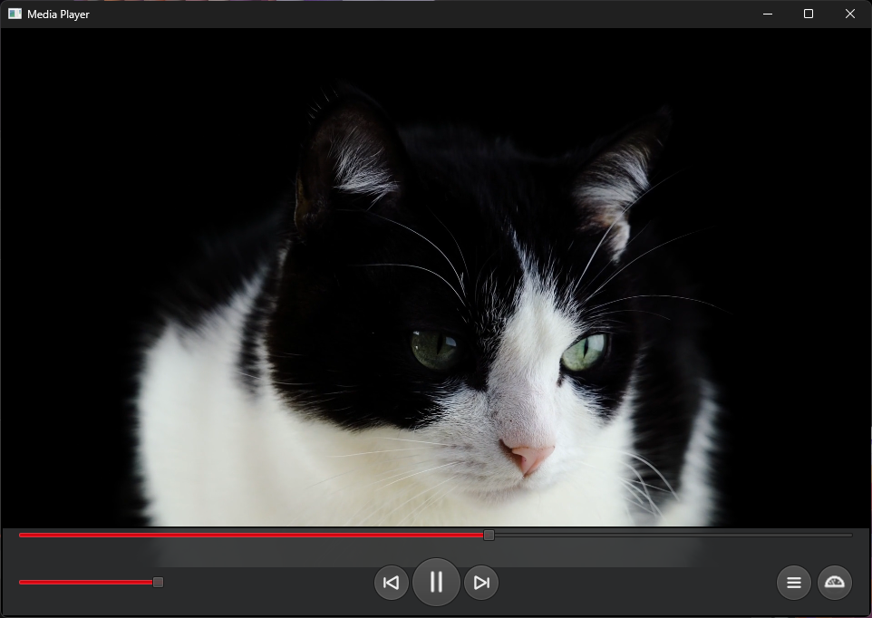

# QtVideoPlayer
Qt 6.6 application for viewing videos
[View demo on YouTube](https://youtu.be/lfewLnPKhuI?si=ePZ2eBnWuvnFvEHz)

The program uses QML for the UI and extends Qt's MediaPlayer class with C++ for the user to take screenshots of the video they are watching.

